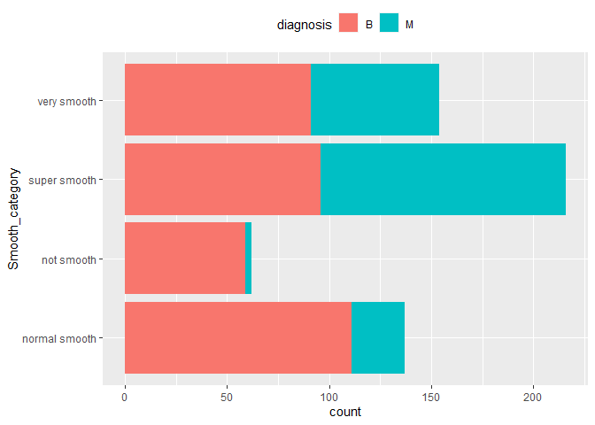
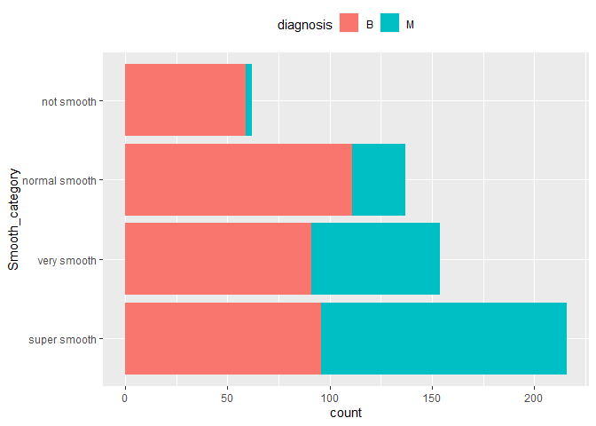
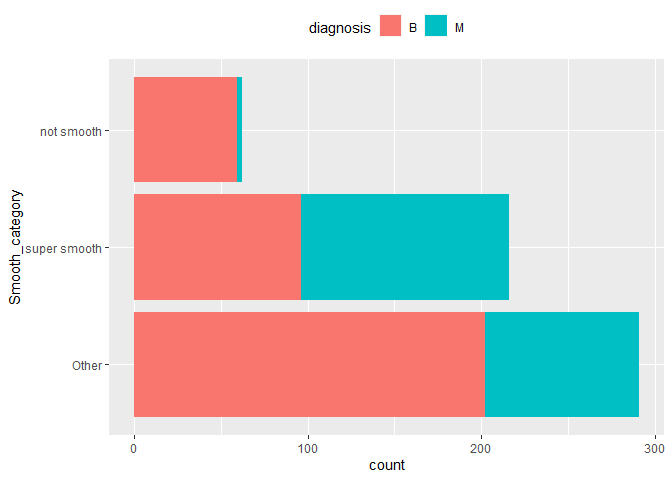

Mini Data Analysis Milestone 2
================

*To complete this milestone, you can edit [this `.rmd`
file](https://raw.githubusercontent.com/UBC-STAT/stat545.stat.ubc.ca/master/content/mini-project/mini-project-2.Rmd)
directly. Fill in the sections that are commented out with
`<!--- start your work here--->`. When you are done, make sure to knit
to an `.md` file by changing the output in the YAML header to
`github_document`, before submitting a tagged release on canvas.*

# Welcome to your second (and last) milestone in your mini data analysis project!

In Milestone 1, you explored your data, came up with research questions,
and obtained some results by making summary tables and graphs. This
time, we will first explore more in depth the concept of *tidy data.*
Then, you’ll be sharpening some of the results you obtained from your
previous milestone by:

- Manipulating special data types in R: factors and/or dates and times.
- Fitting a model object to your data, and extract a result.
- Reading and writing data as separate files.

**NOTE**: The main purpose of the mini data analysis is to integrate
what you learn in class in an analysis. Although each milestone provides
a framework for you to conduct your analysis, it’s possible that you
might find the instructions too rigid for your data set. If this is the
case, you may deviate from the instructions – just make sure you’re
demonstrating a wide range of tools and techniques taught in this class.

# Instructions

**To complete this milestone**, edit [this very `.Rmd`
file](https://raw.githubusercontent.com/UBC-STAT/stat545.stat.ubc.ca/master/content/mini-project/mini-project-2.Rmd)
directly. Fill in the sections that are tagged with
`<!--- start your work here--->`.

**To submit this milestone**, make sure to knit this `.Rmd` file to an
`.md` file by changing the YAML output settings from
`output: html_document` to `output: github_document`. Commit and push
all of your work to your mini-analysis GitHub repository, and tag a
release on GitHub. Then, submit a link to your tagged release on canvas.

**Points**: This milestone is worth 55 points (compared to the 45 points
of the Milestone 1): 45 for your analysis, and 10 for your entire
mini-analysis GitHub repository. Details follow.

**Research Questions**: In Milestone 1, you chose two research questions
to focus on. Wherever realistic, your work in this milestone should
relate to these research questions whenever we ask for justification
behind your work. In the case that some tasks in this milestone don’t
align well with one of your research questions, feel free to discuss
your results in the context of a different research question.

# Learning Objectives

By the end of this milestone, you should:

- Understand what *tidy* data is, and how to create it using `tidyr`.
- Generate a reproducible and clear report using R Markdown.
- Manipulating special data types in R: factors and/or dates and times.
- Fitting a model object to your data, and extract a result.
- Reading and writing data as separate files.

# Setup

Begin by loading your data and the tidyverse package below:

``` r
library(datateachr) # <- might contain the data you picked!
library(tidyverse)
library(forcats)
library(broom)
```

# Task 1: Tidy your data (15 points)

In this task, we will do several exercises to reshape our data. The goal
here is to understand how to do this reshaping with the `tidyr` package.

A reminder of the definition of *tidy* data:

- Each row is an **observation**
- Each column is a **variable**
- Each cell is a **value**

*Tidy’ing* data is sometimes necessary because it can simplify
computation. Other times it can be nice to organize data so that it can
be easier to understand when read manually.

### 2.1 (2.5 points)

Based on the definition above, can you identify if your data is tidy or
untidy? Go through all your columns, or if you have \>8 variables, just
pick 8, and explain whether the data is untidy or tidy.

<!--------------------------- Start your work below --------------------------->

In the cancer data, I first pick the first 8 variables.

``` r
## Per instruction, I  pick the first 8 variables from the cancer dataset
cancer_sample<-datateachr::cancer_sample[,1:8]

## I make the diagnosis variable a factor variable to make analysis easier
cancer_sample$diagnosis <- as.factor(cancer_sample$diagnosis)

## I read the data set and find that each row is an observation for an individual tumor. Each columns are the records on the individual tumor.
cancer_sample
```

    ## # A tibble: 569 × 8
    ##          ID diagnosis radius_mean texture_mean perimet…¹ area_…² smoot…³ compa…⁴
    ##       <dbl> <fct>           <dbl>        <dbl>     <dbl>   <dbl>   <dbl>   <dbl>
    ##  1   842302 M                18.0         10.4     123.    1001   0.118   0.278 
    ##  2   842517 M                20.6         17.8     133.    1326   0.0847  0.0786
    ##  3 84300903 M                19.7         21.2     130     1203   0.110   0.160 
    ##  4 84348301 M                11.4         20.4      77.6    386.  0.142   0.284 
    ##  5 84358402 M                20.3         14.3     135.    1297   0.100   0.133 
    ##  6   843786 M                12.4         15.7      82.6    477.  0.128   0.17  
    ##  7   844359 M                18.2         20.0     120.    1040   0.0946  0.109 
    ##  8 84458202 M                13.7         20.8      90.2    578.  0.119   0.164 
    ##  9   844981 M                13           21.8      87.5    520.  0.127   0.193 
    ## 10 84501001 M                12.5         24.0      84.0    476.  0.119   0.240 
    ## # … with 559 more rows, and abbreviated variable names ¹​perimeter_mean,
    ## #   ²​area_mean, ³​smoothness_mean, ⁴​compactness_mean

``` r
## I check for missing values
any(is.na(cancer_sample))
```

    ## [1] FALSE

``` r
## I checked the cancer data and confirm that the cancer data is tidy
```

I confirm that the cancer data is tidy, because each row is an
observation for a individual tumor. Each columns are the records on the
individual tumor. Each cell has a value. There’s no missing value.

<!----------------------------------------------------------------------------->

### 2.2 (5 points)

Now, if your data is tidy, untidy it! Then, tidy it back to it’s
original state.

If your data is untidy, then tidy it! Then, untidy it back to it’s
original state.

Be sure to explain your reasoning for this task. Show us the “before”
and “after”.

<!--------------------------- Start your work below --------------------------->

Below code to **untidy** cancer data

``` r
## BEFORE: each row is an observation for an individual tumor
print(cancer_sample)
```

    ## # A tibble: 569 × 8
    ##          ID diagnosis radius_mean texture_mean perimet…¹ area_…² smoot…³ compa…⁴
    ##       <dbl> <fct>           <dbl>        <dbl>     <dbl>   <dbl>   <dbl>   <dbl>
    ##  1   842302 M                18.0         10.4     123.    1001   0.118   0.278 
    ##  2   842517 M                20.6         17.8     133.    1326   0.0847  0.0786
    ##  3 84300903 M                19.7         21.2     130     1203   0.110   0.160 
    ##  4 84348301 M                11.4         20.4      77.6    386.  0.142   0.284 
    ##  5 84358402 M                20.3         14.3     135.    1297   0.100   0.133 
    ##  6   843786 M                12.4         15.7      82.6    477.  0.128   0.17  
    ##  7   844359 M                18.2         20.0     120.    1040   0.0946  0.109 
    ##  8 84458202 M                13.7         20.8      90.2    578.  0.119   0.164 
    ##  9   844981 M                13           21.8      87.5    520.  0.127   0.193 
    ## 10 84501001 M                12.5         24.0      84.0    476.  0.119   0.240 
    ## # … with 559 more rows, and abbreviated variable names ¹​perimeter_mean,
    ## #   ²​area_mean, ³​smoothness_mean, ⁴​compactness_mean

``` r
## I lengthen the wide cancer data, so that each row only display one character
## Also, I display the diagnosis(M vs.B)in two columns

cancer_sample_untidy <- cancer_sample %>% 
                pivot_longer(cols=c('radius_mean', 'texture_mean','area_mean','smoothness_mean','compactness_mean','perimeter_mean'), names_to = "Cancer_Character", values_to = "value")   %>% 
            pivot_wider(names_from = diagnosis,values_from = value)

## AFTER: one observation of tumor is reported in 6 rows. For example, row 1-6 shows tumor ID 842302. This is obviously not tidy. Also, the the diagnosis(M vs.B) in two columns
print(cancer_sample_untidy)
```

    ## # A tibble: 3,414 × 4
    ##        ID Cancer_Character         M     B
    ##     <dbl> <chr>                <dbl> <dbl>
    ##  1 842302 radius_mean        18.0       NA
    ##  2 842302 texture_mean       10.4       NA
    ##  3 842302 area_mean        1001         NA
    ##  4 842302 smoothness_mean     0.118     NA
    ##  5 842302 compactness_mean    0.278     NA
    ##  6 842302 perimeter_mean    123.        NA
    ##  7 842517 radius_mean        20.6       NA
    ##  8 842517 texture_mean       17.8       NA
    ##  9 842517 area_mean        1326         NA
    ## 10 842517 smoothness_mean     0.0847    NA
    ## # … with 3,404 more rows

Below code **tidy** it back to it’s original state.

``` r
## BEFORE: one observation of tumor is reported in 6 rows. It is not tidy in this long shape, because the radius, texture, area, smoothness etc., should be separate variables. Also, the diagnosis(M versus B) is reported in two columns.

print(cancer_sample_untidy)
```

    ## # A tibble: 3,414 × 4
    ##        ID Cancer_Character         M     B
    ##     <dbl> <chr>                <dbl> <dbl>
    ##  1 842302 radius_mean        18.0       NA
    ##  2 842302 texture_mean       10.4       NA
    ##  3 842302 area_mean        1001         NA
    ##  4 842302 smoothness_mean     0.118     NA
    ##  5 842302 compactness_mean    0.278     NA
    ##  6 842302 perimeter_mean    123.        NA
    ##  7 842517 radius_mean        20.6       NA
    ##  8 842517 texture_mean       17.8       NA
    ##  9 842517 area_mean        1326         NA
    ## 10 842517 smoothness_mean     0.0847    NA
    ## # … with 3,404 more rows

``` r
## I widen the long data, so that I see the characters of each tumor by puttting these six characters as its own column. 
## Also, I put the the diagnosis is into one column
cancer_sample_tidy <- cancer_sample_untidy %>% 
  pivot_longer(cols=c('M', 'B'), names_to = "diagnosis", values_to = "value",
                            values_drop_na = TRUE) %>% 
  pivot_wider(names_from = "Cancer_Character", values_from = "value") 
              

## AFTER: Now the data is back to its original state. Each row is an observation for an individual tumor and the diagnosis is in one column
print(cancer_sample_tidy)
```

    ## # A tibble: 569 × 8
    ##          ID diagnosis radius_mean texture_mean area_mean smoot…¹ compa…² perim…³
    ##       <dbl> <chr>           <dbl>        <dbl>     <dbl>   <dbl>   <dbl>   <dbl>
    ##  1   842302 M                18.0         10.4     1001   0.118   0.278    123. 
    ##  2   842517 M                20.6         17.8     1326   0.0847  0.0786   133. 
    ##  3 84300903 M                19.7         21.2     1203   0.110   0.160    130  
    ##  4 84348301 M                11.4         20.4      386.  0.142   0.284     77.6
    ##  5 84358402 M                20.3         14.3     1297   0.100   0.133    135. 
    ##  6   843786 M                12.4         15.7      477.  0.128   0.17      82.6
    ##  7   844359 M                18.2         20.0     1040   0.0946  0.109    120. 
    ##  8 84458202 M                13.7         20.8      578.  0.119   0.164     90.2
    ##  9   844981 M                13           21.8      520.  0.127   0.193     87.5
    ## 10 84501001 M                12.5         24.0      476.  0.119   0.240     84.0
    ## # … with 559 more rows, and abbreviated variable names ¹​smoothness_mean,
    ## #   ²​compactness_mean, ³​perimeter_mean

<!----------------------------------------------------------------------------->

### 2.3 (7.5 points)

Now, you should be more familiar with your data, and also have made
progress in answering your research questions. Based on your interest,
and your analyses, pick 2 of the 4 research questions to continue your
analysis in the next four tasks:

<!-------------------------- Start your work below ---------------------------->

1.  For those smooth tumors (i.e., smoothness\>0.1), what is the average
    of radius of malignant tumor and the average of radius of benign
    tumor?
2.  Does the ratio of the worst radius (radius_worst) to mean radius
    (radius_mean) correlates with the tumor diagnosis?

<!----------------------------------------------------------------------------->

Explain your decision for choosing the above two research questions.

<!--------------------------- Start your work below --------------------------->

In the previous milestone, I show that the smoothness is a useful
predictor of tumor diagnosis. I would like to know, conditional on
having a smooth tumor (i.e., smoothness\>0.1), whether the radius of
malignant tumor and the average of radius of benign tumor are different.
If yes, then radius may have some additional explanatory power beyond
smoothness.

In this analysis, I will try to understand whether the ratio of the
worst radius (radius_worst) to mean radius (radius_mean) helps predict
the diagnosis. My hypothesis is that those high ratio tumor (worst case
significantly greater than mean case) may be more likely to be
malicious.

<!----------------------------------------------------------------------------->

Now, try to choose a version of your data that you think will be
appropriate to answer these 2 questions. Use between 4 and 8 functions
that we’ve covered so far (i.e. by filtering, cleaning, tidy’ing,
dropping irrelevant columns, etc.).

<!--------------------------- Start your work below --------------------------->

**Answer to Q1:**

``` r
## To answer question one, I clean the dataset using filter, select, group_by functions and summarize the mean result.

question_1<-datateachr::cancer_sample %>%
  filter(smoothness_mean > 0.1) %>%
  select(c(ID,diagnosis,radius_mean))%>%
  group_by(diagnosis)%>%
  summarise(radius_average=mean(radius_mean))

print(question_1)
```

    ## # A tibble: 2 × 2
    ##   diagnosis radius_average
    ##   <chr>              <dbl>
    ## 1 B                   11.5
    ## 2 M                   17.3

Result suggest that for those smooth tumors, the average of radius of a
malignant tumor is greater than that of a benign tumor. Thus, radius may
have some additional explanatory power beyond smoothness.

**Answer to Q2:**

``` r
## To answer question two, I first use select function to select the variables and use the mutate to cauculate the ratio.

question_2<-datateachr::cancer_sample %>%
  remove_missing()%>%
  select(c(ID,diagnosis,radius_mean,radius_worst))%>%
  mutate(radius_ratio=(radius_worst/radius_mean))

##cleaned data here
question_2$diagnosis <- as.factor(question_2$diagnosis)
print(question_2)
```

    ## # A tibble: 569 × 5
    ##          ID diagnosis radius_mean radius_worst radius_ratio
    ##       <dbl> <fct>           <dbl>        <dbl>        <dbl>
    ##  1   842302 M                18.0         25.4         1.41
    ##  2   842517 M                20.6         25.0         1.21
    ##  3 84300903 M                19.7         23.6         1.20
    ##  4 84348301 M                11.4         14.9         1.31
    ##  5 84358402 M                20.3         22.5         1.11
    ##  6   843786 M                12.4         15.5         1.24
    ##  7   844359 M                18.2         22.9         1.25
    ##  8 84458202 M                13.7         17.1         1.24
    ##  9   844981 M                13           15.5         1.19
    ## 10 84501001 M                12.5         15.1         1.21
    ## # … with 559 more rows

``` r
## Next I run regression
question_2_fit <- glm(diagnosis ~ radius_ratio, data = question_2,family = binomial)
summary(question_2_fit)
```

    ## 
    ## Call:
    ## glm(formula = diagnosis ~ radius_ratio, family = binomial, data = question_2)
    ## 
    ## Deviance Residuals: 
    ##     Min       1Q   Median       3Q      Max  
    ## -2.7623  -0.6101  -0.3476   0.3832   3.2074  
    ## 
    ## Coefficients:
    ##              Estimate Std. Error z value Pr(>|z|)    
    ## (Intercept)   -37.749      3.198  -11.80   <2e-16 ***
    ## radius_ratio   32.611      2.808   11.62   <2e-16 ***
    ## ---
    ## Signif. codes:  0 '***' 0.001 '**' 0.01 '*' 0.05 '.' 0.1 ' ' 1
    ## 
    ## (Dispersion parameter for binomial family taken to be 1)
    ## 
    ##     Null deviance: 751.44  on 568  degrees of freedom
    ## Residual deviance: 438.23  on 567  degrees of freedom
    ## AIC: 442.23
    ## 
    ## Number of Fisher Scoring iterations: 6

Result from the regression analysis suggests that the ratio of the worst
radius (radius_worst) to mean radius (radius_mean) correlates with the
tumor diagnosis.

<!----------------------------------------------------------------------------->

# Task 2: Special Data Types (10)

For this exercise, you’ll be choosing two of the three tasks below –
both tasks that you choose are worth 5 points each.

But first, tasks 1 and 2 below ask you to modify a plot you made in a
previous milestone. The plot you choose should involve plotting across
at least three groups (whether by facetting, or using an aesthetic like
colour). Place this plot below (you’re allowed to modify the plot if
you’d like). If you don’t have such a plot, you’ll need to make one.
Place the code for your plot below.

<!-------------------------- Start your work below ---------------------------->

``` r
##I save the variable to data##
cancer_sample %>%
  mutate(Smooth_category = if_else(smoothness_mean>0.10,"super smooth",
                          if_else(smoothness_mean>0.09, "very smooth", 
                          if_else(smoothness_mean>0.08, "normal smooth", "not smooth")
                          ))) -> cancer_sample_task2

##Plot##
ggplot(cancer_sample_task2, aes(y=Smooth_category) ) + geom_bar(aes(fill=diagnosis), position = position_stack(reverse = TRUE)) + theme(legend.position = "top")
```

<!-- -->

<!----------------------------------------------------------------------------->

Now, choose two of the following tasks.

1.  Produce a new plot that reorders a factor in your original plot,
    using the `forcats` package (3 points). Then, in a sentence or two,
    briefly explain why you chose this ordering (1 point here for
    demonstrating understanding of the reordering, and 1 point for
    demonstrating some justification for the reordering, which could be
    subtle or speculative.)

2.  Produce a new plot that groups some factor levels together into an
    “other” category (or something similar), using the `forcats` package
    (3 points). Then, in a sentence or two, briefly explain why you
    chose this grouping (1 point here for demonstrating understanding of
    the grouping, and 1 point for demonstrating some justification for
    the grouping, which could be subtle or speculative.)

3.  If your data has some sort of time-based column like a date (but
    something more granular than just a year):

    1.  Make a new column that uses a function from the `lubridate` or
        `tsibble` package to modify your original time-based column. (3
        points)

        - Note that you might first have to *make* a time-based column
          using a function like `ymd()`, but this doesn’t count.
        - Examples of something you might do here: extract the day of
          the year from a date, or extract the weekday, or let 24 hours
          elapse on your dates.

    2.  Then, in a sentence or two, explain how your new column might be
        useful in exploring a research question. (1 point for
        demonstrating understanding of the function you used, and 1
        point for your justification, which could be subtle or
        speculative).

        - For example, you could say something like “Investigating the
          day of the week might be insightful because penguins don’t
          work on weekends, and so may respond differently”.

<!-------------------------- Start your work below ---------------------------->

**Task Number**:1

Now the smooth category is ordered by frequency. Now it shows from the
least abundant type to most abundant type. I order by frequency because
it allows the readers to understand which type is more abundant.

``` r
cancer_sample_task2 %>%
  mutate(Smooth_category=fct_infreq(Smooth_category))%>%
ggplot(aes(y=Smooth_category) ) + geom_bar(aes(fill=diagnosis), position = position_stack(reverse = TRUE)) + theme(legend.position = "top")
```

<!-- -->

<!----------------------------------------------------------------------------->
<!-------------------------- Start your work below ---------------------------->

**Task Number**: 2

Since very smooth and normal smooth are similar, Now I groups these
factor levels together into an “other” category. This directly compares
two extreme situations—-the non smooth tumors with super tumors. We can
see not smooth tumor are very likely to be malicious

``` r
cancer_sample_task2 %>%
  mutate(Smooth_category=fct_other(Smooth_category,keep=c('not smooth','super smooth')))%>%
  mutate(Smooth_category=fct_infreq(Smooth_category))%>%
ggplot(aes(y=Smooth_category) ) + geom_bar(aes(fill=diagnosis), position = position_stack(reverse = TRUE)) + theme(legend.position = "top")
```

<!-- -->

<!----------------------------------------------------------------------------->

# Task 3: Modelling

## 2.0 (no points)

Pick a research question, and pick a variable of interest (we’ll call it
“Y”) that’s relevant to the research question. Indicate these.

<!-------------------------- Start your work below ---------------------------->

**Research Question**: Does mean radius and smoothness of a tumor
predict the diagnosis?

**Variable of interest**: diagnosis

<!----------------------------------------------------------------------------->

## 2.1 (5 points)

Fit a model or run a hypothesis test that provides insight on this
variable with respect to the research question. Store the model object
as a variable, and print its output to screen. We’ll omit having to
justify your choice, because we don’t expect you to know about model
specifics in STAT 545.

- **Note**: It’s OK if you don’t know how these models/tests work. Here
  are some examples of things you can do here, but the sky’s the limit.

  - You could fit a model that makes predictions on Y using another
    variable, by using the `lm()` function.
  - You could test whether the mean of Y equals 0 using `t.test()`, or
    maybe the mean across two groups are different using `t.test()`, or
    maybe the mean across multiple groups are different using `anova()`
    (you may have to pivot your data for the latter two).
  - You could use `lm()` to test for significance of regression.

<!-------------------------- Start your work below ---------------------------->

``` r
## I first make the diagnosis a binary variable with malicous being 1.
cancer_sample %>%
mutate(Y_variable = if_else(diagnosis=="B",0,1)) -> task_3
print(task_3)
```

    ## # A tibble: 569 × 9
    ##          ID diagnosis radius_m…¹ textu…² perim…³ area_…⁴ smoot…⁵ compa…⁶ Y_var…⁷
    ##       <dbl> <fct>          <dbl>   <dbl>   <dbl>   <dbl>   <dbl>   <dbl>   <dbl>
    ##  1   842302 M               18.0    10.4   123.    1001   0.118   0.278        1
    ##  2   842517 M               20.6    17.8   133.    1326   0.0847  0.0786       1
    ##  3 84300903 M               19.7    21.2   130     1203   0.110   0.160        1
    ##  4 84348301 M               11.4    20.4    77.6    386.  0.142   0.284        1
    ##  5 84358402 M               20.3    14.3   135.    1297   0.100   0.133        1
    ##  6   843786 M               12.4    15.7    82.6    477.  0.128   0.17         1
    ##  7   844359 M               18.2    20.0   120.    1040   0.0946  0.109        1
    ##  8 84458202 M               13.7    20.8    90.2    578.  0.119   0.164        1
    ##  9   844981 M               13      21.8    87.5    520.  0.127   0.193        1
    ## 10 84501001 M               12.5    24.0    84.0    476.  0.119   0.240        1
    ## # … with 559 more rows, and abbreviated variable names ¹​radius_mean,
    ## #   ²​texture_mean, ³​perimeter_mean, ⁴​area_mean, ⁵​smoothness_mean,
    ## #   ⁶​compactness_mean, ⁷​Y_variable

``` r
## I fit the linear model
                     
fit <- lm(Y_variable ~ radius_mean+smoothness_mean, data = task_3)

glance(fit)
```

    ## # A tibble: 1 × 12
    ##   r.squared adj.r.squ…¹ sigma stati…²   p.value    df logLik   AIC   BIC devia…³
    ##       <dbl>       <dbl> <dbl>   <dbl>     <dbl> <dbl>  <dbl> <dbl> <dbl>   <dbl>
    ## 1     0.589       0.588 0.311    406. 4.09e-110     2  -141.  289.  307.    54.6
    ## # … with 2 more variables: df.residual <int>, nobs <int>, and abbreviated
    ## #   variable names ¹​adj.r.squared, ²​statistic, ³​deviance

``` r
summary(fit)
```

    ## 
    ## Call:
    ## lm(formula = Y_variable ~ radius_mean + smoothness_mean, data = task_3)
    ## 
    ## Residuals:
    ##      Min       1Q   Median       3Q      Max 
    ## -0.84331 -0.21462 -0.05306  0.19793  0.82383 
    ## 
    ## Coefficients:
    ##                  Estimate Std. Error t value Pr(>|t|)    
    ## (Intercept)     -1.763062   0.097759 -18.035   <2e-16 ***
    ## radius_mean      0.094600   0.003754  25.201   <2e-16 ***
    ## smoothness_mean  8.293858   0.940583   8.818   <2e-16 ***
    ## ---
    ## Signif. codes:  0 '***' 0.001 '**' 0.01 '*' 0.05 '.' 0.1 ' ' 1
    ## 
    ## Residual standard error: 0.3107 on 566 degrees of freedom
    ## Multiple R-squared:  0.5894, Adjusted R-squared:  0.5879 
    ## F-statistic: 406.2 on 2 and 566 DF,  p-value: < 2.2e-16

<!----------------------------------------------------------------------------->

## 2.2 (5 points)

Produce something relevant from your fitted model: either predictions on
Y, or a single value like a regression coefficient or a p-value.

- Be sure to indicate in writing what you chose to produce.
- Your code should either output a tibble (in which case you should
  indicate the column that contains the thing you’re looking for), or
  the thing you’re looking for itself.
- Obtain your results using the `broom` package if possible. If your
  model is not compatible with the broom function you’re needing, then
  you can obtain your results by some other means, but first indicate
  which broom function is not compatible.

<!-------------------------- Start your work below ---------------------------->

I choose to predict Y using broom package. The output dataset
“prediction” column named “.fitted” is the predicted value.

``` r
prediction<-broom::augment(fit)
print(prediction)
```

    ## # A tibble: 569 × 9
    ##    Y_variable radius_m…¹ smoot…² .fitted   .resid    .hat .sigma .cooksd .std.…³
    ##         <dbl>      <dbl>   <dbl>   <dbl>    <dbl>   <dbl>  <dbl>   <dbl>   <dbl>
    ##  1          1       18.0  0.118    0.921  0.0792  0.00733  0.311 1.61e-4  0.256 
    ##  2          1       20.6  0.0847   0.886  0.114   0.00999  0.311 4.60e-4  0.370 
    ##  3          1       19.7  0.110    1.01  -0.00863 0.00696  0.311 1.81e-6 -0.0279
    ##  4          1       11.4  0.142    0.499  0.501   0.0239   0.310 2.17e-2  1.63  
    ##  5          1       20.3  0.100    0.988  0.0117  0.00714  0.311 3.45e-6  0.0379
    ##  6          1       12.4  0.128    0.475  0.525   0.0119   0.310 1.16e-2  1.70  
    ##  7          1       18.2  0.0946   0.748  0.252   0.00436  0.311 9.62e-4  0.812 
    ##  8          1       13.7  0.119    0.520  0.480   0.00656  0.310 5.29e-3  1.55  
    ##  9          1       13    0.127    0.523  0.477   0.0112   0.310 8.98e-3  1.55  
    ## 10          1       12.5  0.119    0.399  0.601   0.00716  0.310 9.05e-3  1.94  
    ## # … with 559 more rows, and abbreviated variable names ¹​radius_mean,
    ## #   ²​smoothness_mean, ³​.std.resid

``` r
## results are in the .fitted column
```

Also, I report coefficient on radius_mean.

``` r
coefficient_radius<-coef(fit)[2]
print(coefficient_radius)
```

    ## radius_mean 
    ##  0.09460037

<!----------------------------------------------------------------------------->

# Task 4: Reading and writing data

Get set up for this exercise by making a folder called `output` in the
top level of your project folder / repository. You’ll be saving things
there.

## 3.1 (5 points)

Take a summary table that you made from Milestone 1 (Task 4.2), and
write it as a csv file in your `output` folder. Use the `here::here()`
function.

- **Robustness criteria**: You should be able to move your Mini Project
  repository / project folder to some other location on your computer,
  or move this very Rmd file to another location within your project
  repository / folder, and your code should still work.
- **Reproducibility criteria**: You should be able to delete the csv
  file, and remake it simply by knitting this Rmd file.

<!-------------------------- Start your work below ---------------------------->

``` r
##create the summary table file
datateachr::cancer_sample %>%
  summarise(radius_average=mean(radius_mean),radius_median=median(radius_mean),radius_range=range(radius_mean),radius_sd=sd(radius_mean))->sum_table

dir.create(here::here("output"))
```

    ## Warning in dir.create(here::here("output")): 'C:
    ## \Users\pimi6\OneDrive\Desktop\mini\Mengyang_Guo_MiniAnalysis\output' already
    ## exists

``` r
write_csv(sum_table, here::here("output", "exported_file.csv"))
```

<!----------------------------------------------------------------------------->

## 3.2 (5 points)

Write your model object from Task 3 to an R binary file (an RDS), and
load it again. Be sure to save the binary file in your `output` folder.
Use the functions `saveRDS()` and `readRDS()`.

- The same robustness and reproducibility criteria as in 3.1 apply here.

<!-------------------------- Start your work below ---------------------------->

``` r
saveRDS(fit,file=here::here("output", "my_model.rds"))
readRDS(here::here("output", "my_model.rds"))
```

    ## 
    ## Call:
    ## lm(formula = Y_variable ~ radius_mean + smoothness_mean, data = task_3)
    ## 
    ## Coefficients:
    ##     (Intercept)      radius_mean  smoothness_mean  
    ##         -1.7631           0.0946           8.2939

<!----------------------------------------------------------------------------->

# Tidy Repository

Now that this is your last milestone, your entire project repository
should be organized. Here are the criteria we’re looking for.

## Main README (3 points)

There should be a file named `README.md` at the top level of your
repository. Its contents should automatically appear when you visit the
repository on GitHub.

Minimum contents of the README file:

- In a sentence or two, explains what this repository is, so that
  future-you or someone else stumbling on your repository can be
  oriented to the repository.
- In a sentence or two (or more??), briefly explains how to engage with
  the repository. You can assume the person reading knows the material
  from STAT 545A. Basically, if a visitor to your repository wants to
  explore your project, what should they know?

Once you get in the habit of making README files, and seeing more README
files in other projects, you’ll wonder how you ever got by without them!
They are tremendously helpful.

## File and Folder structure (3 points)

You should have at least four folders in the top level of your
repository: one for each milestone, and one output folder. If there are
any other folders, these are explained in the main README.

Each milestone document is contained in its respective folder, and
nowhere else.

Every level-1 folder (that is, the ones stored in the top level, like
“Milestone1” and “output”) has a `README` file, explaining in a sentence
or two what is in the folder, in plain language (it’s enough to say
something like “This folder contains the source for Milestone 1”).

## Output (2 points)

All output is recent and relevant:

- All Rmd files have been `knit`ted to their output, and all data files
  saved from Task 4 above appear in the `output` folder.
- All of these output files are up-to-date – that is, they haven’t
  fallen behind after the source (Rmd) files have been updated.
- There should be no relic output files. For example, if you were
  knitting an Rmd to html, but then changed the output to be only a
  markdown file, then the html file is a relic and should be deleted.

Our recommendation: delete all output files, and re-knit each
milestone’s Rmd file, so that everything is up to date and relevant.

PS: there’s a way where you can run all project code using a single
command, instead of clicking “knit” three times. More on this in STAT
545B!

## Error-free code (1 point)

This Milestone 1 document knits error-free, and the Milestone 2 document
knits error-free.

## Tagged release (1 point)

You’ve tagged a release for Milestone 1, and you’ve tagged a release for
Milestone 2.

### Attribution

Thanks to Victor Yuan for mostly putting this together.
